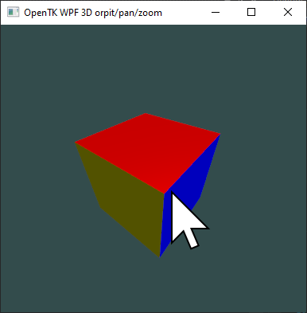
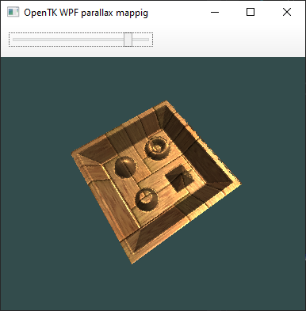
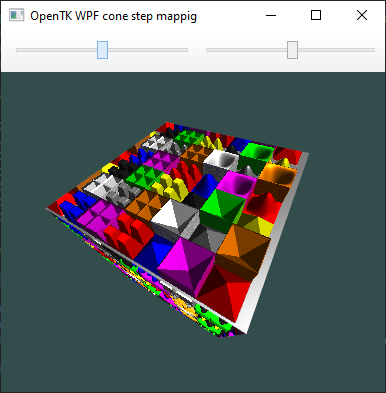

# [OpenTK](https://opentk.net/) examples

A quad

3D mesh

Texture

Compute shader - Barnsley fern

WPF 3D mesh

 WPF Orbit, pan, zoom

WPF Parallax mapping

WPF Cone step mapping

Rubik's cube

Compute shader raytracing

