 &nbsp;&nbsp;&nbsp;&nbsp;&nbsp;&nbsp;&nbsp;&nbsp;&nbsp;&nbsp; 

# OpenTK examples

[OpenTK 4.x](https://opentk.net/), .NET 5.0 (windows)

## Hello Triangle

[Hello Triangle](https://github.com/Rabbid76/c_sharp_opengl/tree/master/OpenTK_hello_triangle)

[Hello Triangle - Windows Forms](https://github.com/Rabbid76/c_sharp_opengl/tree/master/OpenTK_hello_triangle_windows_forms)

[Hello Triangle - WPF](https://github.com/Rabbid76/c_sharp_opengl/tree/master/OpenTK_hello_triangle_WPF)

## 2D Geometry

[A quad](https://github.com/Rabbid76/c_sharp_opengl/tree/master/OpenTK_example_1)

[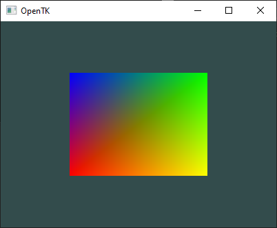](https://github.com/Rabbid76/c_sharp_opengl/tree/master/OpenTK_example_1)

## Texture

[Texture](https://github.com/Rabbid76/c_sharp_opengl/tree/master/OpenTK_example_3)

[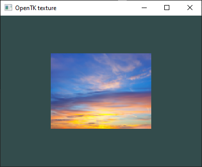](https://github.com/Rabbid76/c_sharp_opengl/tree/master/OpenTK_example_3)

## Text

[FreeType](https://www.freetype.org/) [TrueType Font Text](https://github.com/Rabbid76/c_sharp_opengl/tree/master/OpenTK_example_5)

## Line

[Line](https://github.com/Rabbid76/c_sharp_opengl/tree/master/OpenTK_lines) - See also [Thick lines with OpenGL core profile](https://github.com/Rabbid76/graphics-snippets/blob/master/documentation/thick_line_shader.md) and [Drawing a line in modern OpenGL](https://stackoverflow.com/questions/60440682/drawing-a-line-in-modern-opengl/60440937#60440937)  

[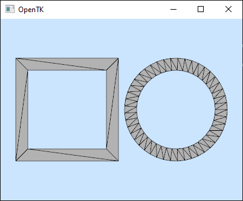](https://github.com/Rabbid76/c_sharp_opengl/tree/master/OpenTK_lines)

## 3D Geometry

[3D mesh](https://github.com/Rabbid76/c_sharp_opengl/tree/master/OpenTK_example_3)

[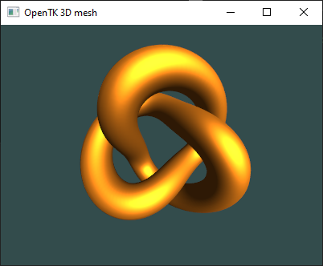](https://github.com/Rabbid76/c_sharp_opengl/tree/master/OpenTK_example_2)

[WPF 3D mesh](https://github.com/Rabbid76/c_sharp_opengl/tree/master/OpenTK_WPF_example_1)

[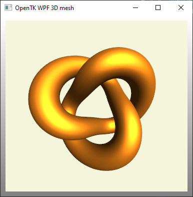](https://github.com/Rabbid76/c_sharp_opengl/tree/master/OpenTK_WPF_example_1)

## Compute shader

[Compute shader - Barnsley fern](https://github.com/Rabbid76/c_sharp_opengl/tree/master/OpenTK_example_4)

[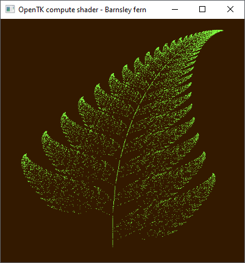](https://github.com/Rabbid76/c_sharp_opengl/tree/master/OpenTK_example_4)

[Compute shader raytracing](https://github.com/Rabbid76/c_sharp_opengl/tree/master/OpenTK_compute_raytracing)

[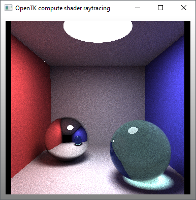](https://github.com/Rabbid76/c_sharp_opengl/tree/master/OpenTK_compute_raytracing)

## Navigation

[WPF Orbit, pan, zoom](https://github.com/Rabbid76/c_sharp_opengl/tree/master/OpenTK_orbit)

[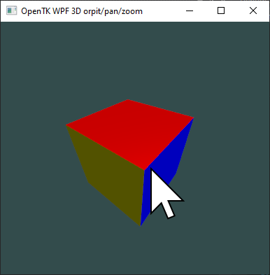](https://github.com/Rabbid76/c_sharp_opengl/tree/master/OpenTK_orbit)

[WPF First person](https://github.com/Rabbid76/c_sharp_opengl/tree/master/OpenTK_controls_firstperson)

[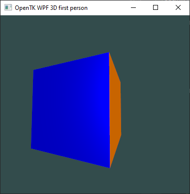](https://github.com/Rabbid76/c_sharp_opengl/tree/master/OpenTK_controls_firstperson)

## Parallax mapping

[WPF Parallax relief mapping](https://github.com/Rabbid76/c_sharp_opengl/tree/master/OpenTK_parallax_relief_mapping)

[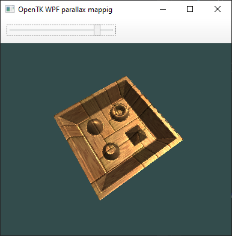](https://github.com/Rabbid76/c_sharp_opengl/tree/master/OpenTK_parallax_relief_mapping)

[WPF Cone step mapping](https://github.com/Rabbid76/c_sharp_opengl/tree/master/OpenTK_parallax_cone_step_mapping)

[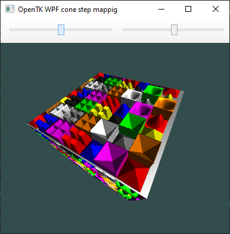](https://github.com/Rabbid76/c_sharp_opengl/tree/master/OpenTK_parallax_cone_step_mapping)

[WPF Generalized_displacement_mapping](https://github.com/Rabbid76/c_sharp_opengl/tree/master/OpenTK_parallax_generalized_displacement_mapping)

[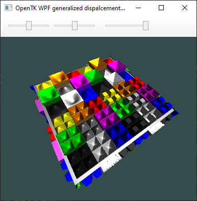](https://github.com/Rabbid76/c_sharp_opengl/tree/master/OpenTK_parallax_generalized_displacement_mapping)

## Applications

[Rubik's cube](https://github.com/Rabbid76/c_sharp_opengl/tree/master/OpenTK_rubiks)

[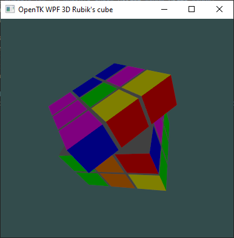](https://github.com/Rabbid76/c_sharp_opengl/tree/master/OpenTK_rubiks)

[Open-Asset-Importer-Lib](http://www.assimp.org/) [Wavefront OBJ](https://de.wikipedia.org/wiki/Wavefront_OBJ) [model](https://github.com/Rabbid76/c_sharp_opengl/tree/master/OpenTK_assimp_example_1)

[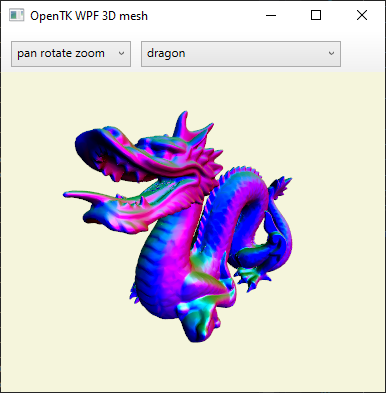](https://github.com/Rabbid76/c_sharp_opengl/tree/master/OpenTK_assimp_example_1)

[Stereoscopic 3D](https://github.com/Rabbid76/c_sharp_opengl/tree/master/OpenTK_stereoscopic_example_1)

[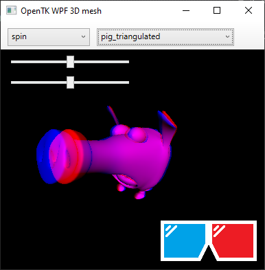](https://github.com/Rabbid76/c_sharp_opengl/tree/master/OpenTK_stereoscopic_example_1)